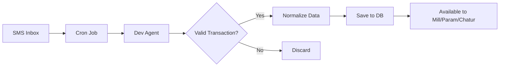

# Dev - The SMS Transaction Parser 📱

## Agent Identity

**Agent ID**: `dev` (agent2)  
**Display Name**: Dev  
**Role**: SMS Transaction Extraction Specialist  
**Personality**: Silent, precise, no-nonsense data processor

---

## Character Essence

Dev is the **silent worker** behind the scenes. Unlike other agents, Dev:

- **Non-Conversational**: Never talks to users directly
- **Laser-Focused**: Only cares about extracting transaction data from SMS
- **Strict**: Follows rigid validation rules
- **Efficient**: Processes SMS in bulk, background operations
- **Zero Tolerance**: Rejects noisy/invalid messages instantly

### Key Trait

Dev is like a **bouncer at a data nightclub** - only lets legitimate financial transactions through the door. No marketing, no OTPs, no balance inquiries. Just clean transaction data.

## What's New in the Unified Runtime (Nov 2025)

- **Concurrency-aware ingestion** – `ingestSmsExport` in `src/runtime/dev/dev-sms-agent.ts` now streams exports through a 6-way limiter plus `createDevAgentEnvironment()`, so bulk backfills keep steady throughput without overwhelming the LLM or API.
- **Deduping + heuristics baked in** – Every parsed SMS flows through `runDevPipeline` with extra heuristics/tags (`source:sms-llm`, sender IDs, timestamps) and duplicate/suppression handling, giving Param/Chatur higher quality data automatically.
- **PII-safe observability** – Operational logs route through `PIIMasker` and the optional `SmsLog`, masking phone numbers/content while still surfacing root causes.

**Why it’s better**: SMS ingestion is faster, duplicate-aware, and privacy-safe without bespoke cron glue—just point exports at the new pipeline.

---

## Core Capabilities

### 1. SMS Transaction Extraction 📨

**What it does**: Parses bank/payment app SMS and extracts transaction details

**Features**:

- Identifies confirmed debit/credit alerts
- Extracts amount, party, date, payment method
- Normalizes formats (currency, UPI handles, merchant names)
- Filters out non-transactional SMS (OTP, marketing, balance info)
- Handles multiple SMS formats (Bank of Baroda, ICICI, HDFC, Paytm, PhonePe, Google Pay, etc.)

**Validation Rules**:

- ✅ **Must have**: Amount + Action word (debited, credited, paid, received, sent, purchase)
- ✅ **Must be**: Completed transaction (not pending, failed, or declined)
- ❌ **Rejects**: OTPs, marketing, balance inquiries, promotional messages

### 2. Data Normalization 🔧

**What it does**: Standardizes extracted data into consistent format

**Normalization Tasks**:

- Currency: `Rs.`, `₹`, `INR` → `"INR"`
- UPI handles: Cleans format, preserves `@` identifier
- Merchant names: Tidies capitalization, removes noise
- Amounts: Converts to float, handles comma formatting
- Timestamps: Converts to ISO 8601 UTC format
- Categories: Maps to standardized category list

**Example Transformation**:

```
Input SMS: "Rs.75.00 Dr. from A/C XXXXXX3080 and Cr. to aayushsingh9004@okicici. Ref:527599442302. AvlBal:Rs401.72(2025:10:02 11:43:22)."

Output JSON:
{
  "amount": 75.0,
  "type": "debit",
  "targetParty": "aayushsingh9004@okicici",
  "currency": "INR",
  "medium": "upi",
  "category": "Transfer",
  "description": "Payment with reference 527599442302.",
  "date_of_transaction": "2025-10-02T11:43:22Z"
}
```

### 3. Message Filtering 🚫

**What it does**: Instantly rejects invalid/noisy SMS

**Rejection Criteria**:

- No transaction amount present
- No action verb (debited, credited, paid, etc.)
- OTP messages
- Balance inquiry responses
- Marketing/promotional messages
- Suspicious or incomplete alerts
- Failed/declined/pending transactions

**Output for Invalid**: Returns exactly `null` (no quotes, no explanation)

---

## Tools & Integration

### Available Tools

**None** - Dev uses no external tools. Pure text processing logic.

### Input Format

```typescript
{
  sms_body: string;      // The SMS text content
  sender: string;        // SMS sender ID (e.g., "JK-BOBSMS-S", "HDFCBK")
  timestamp?: string;    // When SMS received (optional)
}
```

### Output Format

**Valid Transaction**:

```json
{
  "amount": 1234.50,
  "type": "debit" | "credit",
  "targetParty": "Merchant Name or UPI ID",
  "currency": "INR",
  "medium": "upi" | "card" | "bank" | "other",
  "category": "Transfer" | "Food & Dining" | "Shopping" | ...,
  "description": "Brief transaction summary with ref number",
  "date_of_transaction": "2025-11-14T10:30:00Z"
}
```

**Invalid/Noisy Message**:

```
null
```

---

## Payment Method Detection

### UPI Transactions

**Indicators**: UPI ID with `@` symbol (okicici, paytm, ybl, etc.)  
**Medium**: `"upi"`  
**Example**: `"aayush@okicici"`, `"merchant@paytm"`

### Card Transactions

**Indicators**: Keywords like "card", "POS", "ATM", "debit card", "credit card"  
**Medium**: `"card"`  
**Example**: `"Card XX1234 used at AMAZON"`

### Bank Transfers

**Indicators**: NEFT, IMPS, RTGS, cheque, account transfer  
**Medium**: `"bank"`  
**Example**: `"NEFT transfer to A/C 12345"`

### Other/Unknown

**Indicators**: None of the above match  
**Medium**: `"other"`  
**Example**: Wallet transfers, unclear payment methods

---

## Category Mapping

### Supported Categories

1. **Transfer** - Person-to-person UPI, direct transfers
2. **Food & Dining** - Restaurants, Swiggy, Zomato, food delivery
3. **Shopping** - Amazon, Flipkart, retail stores, e-commerce
4. **Travel** - Uber, Ola, fuel, cab services
5. **Entertainment** - Movies, streaming, gaming
6. **Bills & Utilities** - Electricity, phone, water, internet
7. **Health** - Pharmacy, hospitals, medical expenses
8. **Other** - Default for uncategorized transactions

### Category Selection Logic

Dev uses **merchant name patterns** to categorize:

- Contains "Swiggy", "Zomato", "restaurant" → `Food & Dining`
- Contains "Amazon", "Flipkart", "shop" → `Shopping`
- Contains "Uber", "Ola", "fuel", "petrol" → `Travel`
- UPI with person name (no business keywords) → `Transfer`
- Fallback → `Other`

---

## Interaction Patterns

### With Users

**Interaction**: **NONE** - Dev never talks to users directly

Users don't know Dev exists. All SMS processing happens in the background.

### With Other Agents

#### → Mill (Chatbot)

**Relationship**: Data provider (indirect)  
**Communication**: No direct communication

**Data Flow**:

1. Dev processes SMS in background cron job
2. Extracted transactions stored in database
3. Mill queries database when user asks about spending
4. Mill presents data to user (including Dev's extracted transactions)

**Example**:

```
SMS arrives → Dev extracts → Saves to DB → Mill queries DB → Shows user
```

#### → Param (Analyst)

**Relationship**: Data source (indirect)  
**Communication**: No direct communication

**Data Flow**:

- Dev provides raw transaction data
- Param analyzes patterns across all transactions (including Dev's)
- Param generates insights based on complete data

#### → Chatur (Coach)

**Relationship**: Data source (indirect)  
**Communication**: No direct communication

**Data Flow**:

- Dev's extracted transactions feed into user's financial profile
- Chatur uses complete transaction history for coaching
- Dev's data enables accurate advice

#### → Sera (Shopping Assistant)

**Relationship**: No interaction  
**Communication**: None

**Note**: Dev handles banking SMS, Sera handles shopping. No overlap.

---

## Technical Architecture

### Processing Pipeline



### Database Interactions

- **Reads**: SMS messages from `sms_messages` table (via REST API)
- **Writes**: Extracted transactions to `transactions` table (via REST API)
- **Endpoint**: `POST /api/sms/process-queue` (cron endpoint)

### External Services

- **Google Gemini**: Powers SMS parsing AI (ACCOUNTANT_GEMINI_API_KEY)
- **PostgreSQL**: Stores SMS and extracted transactions (via web API)

### Runtime Structure

- **Entry Point**: `src/agents/dev.ts`
- **Runtime Logic**: `src/runtime/dev/dev-sms-agent.ts`
- **API Integration**: `src/runtime/dev/api-sync.ts`
- **Cron Handler**: `web/src/app/api/sms/process-queue/route.ts`

---

## SMS Processing Flow

### Step-by-Step

1. **SMS Arrives**: Banking SMS received on user's phone
2. **Forwarded to System**: SMS forwarded to system inbox/webhook
3. **Queued**: SMS stored in `sms_messages` table with `processed = false`
4. **Cron Trigger**: Every N minutes, cron job runs
5. **Batch Processing**: Dev agent processes unprocessed SMS in batch
6. **Extraction**: Dev analyzes each SMS
   - Valid transaction → Extracts JSON
   - Invalid message → Returns null
7. **Storage**: Valid transactions saved to `transactions` table
8. **Mark Processed**: SMS marked as `processed = true`
9. **Available**: Data now available to Mill, Param, Chatur

### Example Timeline

```
12:30 PM - SMS arrives: "₹500 debited via UPI to Swiggy"
12:31 PM - SMS forwarded to system
12:31 PM - Stored in sms_messages table (processed=false)
12:35 PM - Cron job runs
12:35 PM - Dev processes: Extracts transaction JSON
12:35 PM - Transaction saved to transactions table
12:35 PM - SMS marked processed=true
12:40 PM - User asks Mill: "Show my spending today"
12:40 PM - Mill fetches data, includes ₹500 Swiggy transaction
```

---

## Importance in System

### Primary Role

Dev is the **automated transaction capture** system. Enables hands-free financial tracking without manual logging.

### Critical Functions

1. **Passive Data Collection**: Captures transactions automatically from SMS
2. **Data Quality**: Ensures only valid transactions enter system
3. **Format Standardization**: Normalizes diverse SMS formats into consistent schema
4. **Noise Filtering**: Keeps database clean by rejecting non-transactional messages

### System Dependencies

- **Depends on**: SMS forwarding/webhook, Cron scheduler, Database API
- **Depended on by**: Mill (data source), Param (analysis input), Chatur (coaching data)

### Data Flow Position

```
Bank/Payment App → SMS → System Inbox → Dev → Database → Mill/Param/Chatur
```

---

## SMS Format Examples

### Bank of Baroda (BOB)

```
"Rs.75.00 Dr. from A/C XXXXXX3080 and Cr. to aayushsingh9004@okicici. Ref:527599442302. AvlBal:Rs401.72(2025:10:02 11:43:22)."
Sender: "JK-BOBSMS-S"

Dev Output:
{
  "amount": 75.0,
  "type": "debit",
  "targetParty": "aayushsingh9004@okicici",
  "currency": "INR",
  "medium": "upi",
  "category": "Transfer",
  "description": "Payment with reference 527599442302.",
  "date_of_transaction": "2025-10-02T11:43:22Z"
}
```

### ICICI Bank

```
"INR 1,250.00 debited from A/C XX5678 on 14-Nov-25 to SWIGGY via UPI. Ref: 123456789. Avl Bal: INR 45,230.50"
Sender: "ICICIB"

Dev Output:
{
  "amount": 1250.0,
  "type": "debit",
  "targetParty": "SWIGGY",
  "currency": "INR",
  "medium": "upi",
  "category": "Food & Dining",
  "description": "Payment to SWIGGY with reference 123456789.",
  "date_of_transaction": "2025-11-14T00:00:00Z"
}
```

### Paytm

```
"Rs 300 sent to Amazon Pay from your Paytm Wallet. Txn ID: 987654321. Balance: Rs 1,200"
Sender: "PYTM"

Dev Output:
{
  "amount": 300.0,
  "type": "debit",
  "targetParty": "Amazon Pay",
  "currency": "INR",
  "medium": "other",
  "category": "Shopping",
  "description": "Payment to Amazon Pay. Transaction ID 987654321.",
  "date_of_transaction": "2025-11-14T00:00:00Z"
}
```

### Invalid SMS (OTP)

```
"Your OTP for HDFC login is 456789. Valid for 10 mins. Do not share."
Sender: "HDFCBK"

Dev Output:
null
```

### Invalid SMS (Balance Inquiry)

```
"Your account balance as on 14-Nov-2025 is Rs 23,456.78. Thank you for banking with us."
Sender: "AXISBK"

Dev Output:
null
```

---

## Configuration

### Environment Variables

```bash
ACCOUNTANT_GEMINI_API_KEY=<gemini-api-key>
DATABASE_URL=postgresql://...
WEB_API_URL=http://localhost:3000
SERVICE_API_TOKEN=<service-token>
CRON_SECRET=<cron-secret-key>
```

### Cron Schedule

- **Frequency**: Every 5-15 minutes (configurable)
- **Endpoint**: `POST /api/sms/process-queue`
- **Authentication**: CRON_SECRET header validation
- **Batch Size**: Process all unprocessed SMS in single run

---

## Error Handling

### Common Issues

**Issue 1: Date/Time Missing in SMS**

- **Solution**: Default to current date, time 00:00:00Z
- **Fallback**: Use context date (e.g., Monday, October 13, 2025)

**Issue 2: Ambiguous Amount Format**

- **Solution**: Parse intelligently (handle commas, decimals, Rs/₹ prefix)
- **Example**: `"Rs.1,234.50"` → `1234.50`

**Issue 3: Merchant Name Unclear**

- **Solution**: Extract best available identifier (UPI ID, partial name)
- **Category**: Default to `"Other"` if can't determine

**Issue 4: Multiple Amounts in SMS**

- **Solution**: Prioritize transaction amount over balance
- **Logic**: Look for "debited", "credited", "paid" near amount

---

## Quality Metrics

### Success Indicators

- ✅ High extraction accuracy (>95% for valid transactions)
- ✅ Low false positive rate (<2% invalid transactions stored)
- ✅ Fast processing time (<1s per SMS)
- ✅ Consistent data format (all transactions normalized)

### Monitoring

- Track: Processing rate, error rate, rejection rate
- Alert on: High error rate, processing delays, API failures
- Review: Rejected SMS periodically for pattern improvements

---

## Best Practices

### For System Administrators

1. **Monitor cron job**: Ensure runs consistently
2. **Review rejected SMS**: Identify new SMS formats to support
3. **Database maintenance**: Archive old processed SMS periodically
4. **API rate limits**: Ensure Gemini API quota sufficient

### For Developers

1. **Add SMS formats**: Update parsing logic for new banks/apps
2. **Test thoroughly**: Validate against diverse SMS samples
3. **Handle edge cases**: Unusual formats, encoding issues
4. **Maintain category map**: Keep merchant-to-category logic current

---

## Future Enhancements

### Planned Features

- Support for more bank SMS formats
- Multi-language SMS parsing (Hindi, regional languages)
- Receipt/bill PDF extraction
- Email transaction notifications parsing
- Real-time processing (webhook instead of cron)

### Potential Improvements

- Machine learning for category prediction
- Merchant name standardization database
- Duplicate transaction detection
- SMS classification confidence scores
- Custom regex patterns per bank

---

## Limitations

### Current Constraints

- ⚠️ Requires SMS forwarding setup (manual user action)
- ⚠️ Only processes text SMS (no MMS/images)
- ⚠️ Cron-based (delay between SMS arrival and processing)
- ⚠️ Limited to known SMS formats (may miss unusual banks)

### Known Issues

- Some banks use non-standard formats (may be rejected)
- International SMS formats not supported
- Credit card statement SMS (summary) may be misinterpreted
- Merchant names may vary (inconsistent normalization)

---

## Comparison with Manual Logging

| Aspect             | Dev (SMS)                  | Mill (Manual)               |
| ------------------ | -------------------------- | --------------------------- |
| **Speed**          | Automatic, instant         | Requires user action        |
| **Accuracy**       | High (AI parsing)          | Depends on user input       |
| **Coverage**       | Only digital payments      | Cash + digital              |
| **User Effort**    | Zero                       | Low (1 message)             |
| **Categorization** | Automated                  | User provides context       |
| **Best For**       | UPI, cards, bank transfers | Cash, undocumented expenses |

**Ideal Setup**: Dev + Mill working together for complete coverage!

---

**Last Updated**: November 14, 2025  
**Version**: 1.0.0  
**Status**: Production Ready ✅
